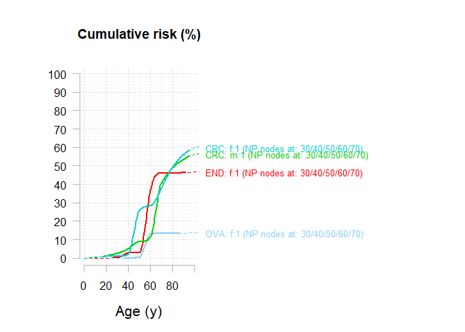
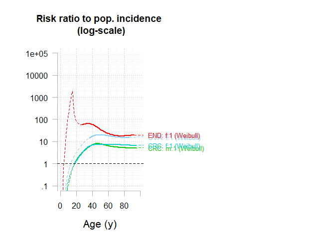

<!-- README.md is generated from README.Rmd. Please edit that file -->

# generisk <a href="https://github.com/youenndrouet/generisk"></a>

<!-- badges: start -->
<!-- badges: end -->

## Overview

The goal of generisk is to perform estimation of the Genotype Restricted
Likelihood (GRL) from family data.

The main function is `generisk()`.

## Installation

You can install the development version of generisk like so:

``` r
# install.packages("pak")
pak::pak("youenndrouet/generisk")
```

## Example

This is a basic example which shows you how to use generisk on a dataset
of 236 Lynch Syndrome french families with MLH1 mutations. The first
analysis of the full dataset comprising 537 families with the GRL method
is published here (Bonadona et al. JAMA 2011)
<https://jamanetwork.com/journals/jama/fullarticle/900645>.

``` r
library(generisk) # load the generisk package
library(dplyr) # load the dplyr package to manipulate the data
#> Warning: le package 'dplyr' a été compilé avec la version R 4.2.3
#> 
#> Attachement du package : 'dplyr'
#> Les objets suivants sont masqués depuis 'package:stats':
#> 
#>     filter, lag
#> Les objets suivants sont masqués depuis 'package:base':
#> 
#>     intersect, setdiff, setequal, union

# generisk package comes with the eriscam_mlh1 dataset

dat_GRL <- eriscam_mlh1 %>%
   mutate(SEX_recoded = if_else(SEX == 1, 1, 0),
         CRC_event = if_else(!is.na(COLORECTUM),
                             if_else(!is.na(FIRST_COLONOSCOPY), 
                                    if_else(COLORECTUM < FIRST_COLONOSCOPY, 
                                            1, 
                                            0),
                                    1), 
                             0),
         CRC_age = if_else(!is.na(COLORECTUM),
                             if_else(!is.na(FIRST_COLONOSCOPY), 
                                    if_else(COLORECTUM < FIRST_COLONOSCOPY, 
                                            COLORECTUM, 
                                            FIRST_COLONOSCOPY),
                                    AGE_AT_LAST_NEWS), 
                             AGE_AT_LAST_NEWS),
         
         END_event = if_else(!is.na(ENDOMETRIUM),
                             if_else(!is.na(HYSTERECTOMY), 
                                    if_else(ENDOMETRIUM < HYSTERECTOMY, 
                                            1, 
                                            0),
                                    1), 
                             0),
         END_age = if_else(!is.na(ENDOMETRIUM),
                             if_else(!is.na(HYSTERECTOMY), 
                                    if_else(ENDOMETRIUM < HYSTERECTOMY, 
                                            ENDOMETRIUM, 
                                            HYSTERECTOMY),
                                    AGE_AT_LAST_NEWS), 
                             AGE_AT_LAST_NEWS),
         OVA_event = if_else(!is.na(OVARY),
                             if_else(!is.na(OOPHORECTOMY), 
                                    if_else(OVARY < OOPHORECTOMY, 
                                            1, 
                                            0),
                                    1), 
                             0),
         OVA_age = if_else(!is.na(OVARY),
                             if_else(!is.na(OOPHORECTOMY), 
                                    if_else(OVARY < OOPHORECTOMY, 
                                            OVARY, 
                                            OOPHORECTOMY),
                                    AGE_AT_LAST_NEWS), 
                             AGE_AT_LAST_NEWS)
         ) 

dat_MLH1 <- dat_GRL %>% 
   select(FAMILY_ID, PERSON_ID, SEX_recoded, FATHER_ID, MOTHER_ID, PROBAND_FLAG, MLH1_STATUS, CRC_event, CRC_age, END_event, END_age, OVA_event, OVA_age)
```

``` r
# Populational incidence data for 100,000 individuals (ref: FRANCIM 2018)
# at age classes : 
# [0;14] [15;19] [20;24] [25;29] [30;34] [35;39] [40;44] [45;49] [50;54] 
# [55;59] [60;64] [65;69] [70;74] [75;79] [80;84] [85;89] [90;94] [95;+]

# colorectal cancer

CRCm <- c(0.3, 0.9, 1.7, 3.1, 4.9, 7.3, 12.7, 25.3, 49.8, 86.2, 136.6, 199.9, 261.8, 327.9, 414.1, 503.8, 480.3, 335.0)
CRCf <- c(0.4, 1.7, 2.5, 3.2, 4.5, 8.3, 15.8, 27.3, 43.1, 62.8, 88.5, 121.8, 157.8, 200.9, 256.4, 315.5, 320.3, 257.5)

# endometrium
ENDm <- rep(0, 18)
ENDf <- c(0, 0, 0.1, 0.3, 0.6, 1.4, 3.3, 8.2, 18.4, 33.4, 53.8, 77.6, 93.4, 92.6, 77.5, 57.2, 37.6, 23.2)

## ovaire
OVAm <- rep(0, 18)
OVAf <- c(0.4, 1.1, 1.4, 1.6, 2.0, 3.1, 5.2, 8.8, 14.1, 20.8, 29.7, 40.6, 48.7, 51.2, 49.0, 43.9, 36.1, 27.4)


Ft.compute <- function(x, ft=NULL){
  
  if(is.null(ft)){
    ft <- c(0,rep(x[1],14), rep(x[2:17],each = 5), rep(x[18],26))
  }
  ft.smo <- smooth.spline(ft, df=15)$y
  
  wiout <- which(ft.smo <= 0) 
  ft.smo[wiout] <- ft[wiout]
  
  Ft <- numeric(121) 
  for(t in (2:121)){  
    Ft[t] = Ft[t-1] + (1 - Ft[t-1])*(ft.smo[t]/100000)
  }
  
  names(Ft) <- as.character(0:120)
  Ft["0"] <- 0
  
  return(Ft)
}


Ft.CRC <- cbind("m"=Ft.compute(CRCm), "f" = Ft.compute(CRCf))
Ft.END <- cbind("m"=Ft.compute(ENDm), "f" = Ft.compute(ENDf))
Ft.OVA <- cbind("m"=Ft.compute(OVAm), "f" = Ft.compute(OVAf))
```

``` r
myFt <- list("CCR" = Ft.CRC, "END" = Ft.END, "OVA" = Ft.OVA)

myParams_NP <- list(
  
  "CRC" = list(
    penet.model   = "np",
    agenodes = c(30,40,50,60,70),
    inheritance   = "dominant",
    implic.loci   = TRUE,
    gender.effect = TRUE),
  
  "END" = list(
    penet.model   = "np",
    agenodes = c(30,40,50,60,70),
    inheritance   = "dominant",
    implic.loci   = TRUE,
    gender.effect = TRUE),
  
  "OVA" = list(
    penet.model   = "np",
    agenodes = c(30,40,50,60,70),
    inheritance   = "dominant",
    implic.loci   = TRUE,
    gender.effect = TRUE)
)


# check alignement
cbind(names(myFt),names(myParams_NP), names(dat_MLH1)[seq(8,13,2)])
#>      [,1]  [,2]  [,3]       
#> [1,] "CCR" "CRC" "CRC_event"
#> [2,] "END" "END" "END_event"
#> [3,] "OVA" "OVA" "OVA_event"

estim_NP <- generisk(Ft.pop = myFt,
                          FIT.pars = myParams_NP,
                          fA = 1/1946, 
         # https://www.ncbi.nlm.nih.gov/pmc/articles/PMC5336409/pdf/nihms827219.pdf
                          DATA = as.data.frame(dat_MLH1),
                          B = 0,
                          multi.pheno = "all",
                          imput_missing_age_last_news = FALSE, 
                          ncores = 2)
#>  ________________________________________
#>                                          
#>   The generisk R program 
#>   version: 0.0.0.9000 
#>                                         
#>   Number of families:  236 
#>    - CRC_event :  783 / 783  affected individuals will be analyzed 
#>    - END_event :  70 / 70  affected individuals will be analyzed 
#>    - OVA_event :  29 / 29  affected individuals will be analyzed 
#>    - Unaffected individuals: 1418 / 3886  individuals with missing age at last news removed from analysis (age --> 0) 
#> 
#> Parallel computing using 2 / 8 available cores. 
#>   -> Program initialization. 
#>   -> Pre-calculations to speed-up likelihood algorithm. 
#>   -> ML optimization by nlminb. 
#>   0:     697.36737: -7.90240 -7.32511 -6.08231 -4.87152 -4.03744 -1.81097 -7.69232 -7.18030 -6.02310 -5.16432 -4.50888 -2.13868 -10.6159 -9.06685 -7.21597 -5.81725 -4.96980 -3.79609 -8.19535 -8.15298 -7.14315 -6.26111 -5.59995 -4.02964
#>   1:     567.96038: -6.73629 -6.30674 -4.39910 -3.71886 -2.82446 -1.77724 -6.53948 -6.26308 -4.34617 -4.07379 -3.44588 -2.06517 -10.4835 -8.82559 -6.80874 -5.26447 -4.71520 -3.76808 -8.09930 -8.06677 -7.00820 -6.14239 -5.59200 -4.02450
#>   2:     536.89111: -5.44737 -6.56285 -3.07174 -3.60396 -2.79957 -1.81097 -5.10171 -5.95967 -2.25346 -3.66844 -3.43397 -1.94210 -10.0751 -8.02655 -5.86749 -4.60948 -4.51011 -3.75308 -7.80096 -7.84537 -6.87332 -5.72528 -5.55085 -4.00837
#>   3:     530.84340: -4.77354 -6.49713 -2.17069 -3.33676 -2.30486 -1.81097 -4.78945 -5.86909 -1.18958 -3.59402 -3.26566 -1.93575 -9.81218 -7.51471 -5.66090 -3.99001 -4.41216 -3.74272 -7.64341 -7.73568 -6.82900 -5.49663 -5.52619 -4.00668
#>   4:     527.49475: -4.09326 -6.48204 -2.25734 -3.30070 -1.99606 -1.81097 -4.69828 -5.83392 -1.10983 -3.53535 -3.13628 -1.92092 -9.25830 -6.78197 -4.67067 -3.02177 -4.14991 -3.73966 -7.46193 -7.60782 -6.72004 -5.02660 -5.50030 -4.00463
#>   5:     526.26098: -3.97477 -6.47852 -2.41193 -3.30493 -1.82218 -1.81097 -4.69927 -5.81362 -1.19742 -3.49940 -3.04834 -1.91566 -8.99430 -6.53607 -4.29370 -2.44072 -4.03639 -3.73939 -7.40726 -7.56979 -6.66756 -4.72539 -5.48397 -4.00386
#>   6:     526.11075: -3.80238 -6.46809 -2.55979 -3.31328 -1.48004 -1.81097 -4.65493 -5.75277 -0.717077 -3.41572 -2.85144 -1.90787 -8.54045 -6.15116 -3.71973 -1.13301 -3.84885 -3.73964 -7.31769 -7.52174 -6.55173 -4.15929 -5.45102 -4.00345
#>   7:     523.90389: -3.73845 -6.46666 -2.63878 -3.32930 -1.36255 -1.81097 -4.66423 -5.73584 -1.38992 -3.41253 -2.80537 -1.91159 -8.36200 -6.00491 -3.51062 -0.724636 -3.77872 -3.74019 -7.28098 -7.50374 -6.50454 -3.92690 -5.44033 -4.00336
#>   8:     523.65049: -3.74255 -6.46555 -2.65783 -3.34059 -1.38946 -1.81097 -4.65366 -5.72167 -1.36650 -3.41841 -2.79864 -1.91354 -8.32041 -5.96114 -3.53390 -1.12248 -3.78216 -3.74050 -7.25842 -7.49373 -6.49658 -3.84313 -5.44545 -4.00344
#>   9:     523.25029: -3.67634 -6.44465 -2.84385 -3.40171 -1.33142 -1.81097 -4.59890 -5.61926 -1.20130 -3.38208 -2.67042 -1.88300 -7.89173 -5.57998 -3.23877 -1.07810 -3.66098 -3.74227 -7.13364 -7.43809 -6.39754 -3.16425 -5.44822 -4.00384
#>  10:     522.94285: -3.63196 -6.41120 -2.82111 -3.45617 -1.29739 -1.81097 -4.63330 -5.49463 -1.27170 -3.39031 -2.60405 -1.81704 -7.51631 -5.27209 -3.18657 -0.992484 -3.53448 -3.74496 -7.04232 -7.40953 -6.33340 -2.54994 -5.45377 -4.00477
#>  11:     522.77485: -3.68038 -6.35707 -2.74599 -3.53113 -1.31104 -1.81097 -4.62172 -5.25739 -1.41633 -3.44551 -2.59411 -1.65622 -7.05011 -4.89135 -3.33919 -0.943129 -3.35511 -3.74902 -6.94812 -7.39166 -6.27762 -1.95237 -5.46035 -4.00648
#>  12:     522.67986: -3.70896 -6.34726 -2.66774 -3.56232 -1.27037 -1.81097 -4.61523 -5.11869 -1.45680 -3.49680 -2.56874 -1.60728 -6.90181 -4.78770 -3.48945 -1.00336 -3.29382 -3.75119 -6.93790 -7.40080 -6.27390 -2.02122 -5.46252 -4.00736
#>  13:     522.55593: -3.77226 -6.30627 -2.61540 -3.66762 -1.29920 -1.81097 -4.61367 -4.70033 -1.50054 -3.61121 -2.39522 -1.50393 -6.40896 -4.38975 -3.74937 -1.08513 -3.06342 -3.75690 -6.88176 -7.40788 -6.23819 -1.87739 -5.46246 -4.00979
#>  14:     522.51271: -3.79876 -6.25003 -2.57005 -3.84263 -1.17196 -1.81097 -4.66296 -3.95758 -1.52338 -3.79787 -2.11079 -1.36053 -5.61142 -3.74526 -4.14795 -1.19199 -2.61189 -3.76728 -6.80694 -7.42453 -6.17254 -1.63705 -5.45929 -4.01399
#>  15:     522.46807: -3.78566 -6.24961 -2.64857 -3.81087 -1.27814 -1.81097 -4.67814 -4.07833 -1.51096 -3.76375 -2.20843 -1.36377 -5.82677 -3.94782 -4.13813 -1.17407 -2.63745 -3.76564 -6.85354 -7.43444 -6.20082 -1.88777 -5.45933 -4.01368
#>  16:     522.44721: -3.75440 -6.23435 -2.64774 -3.81234 -1.23860 -1.81097 -4.67550 -4.09555 -1.50379 -3.75366 -2.31767 -1.28279 -5.84812 -3.99315 -4.18738 -1.15770 -2.52809 -3.76671 -6.87374 -7.44381 -6.20215 -1.92266 -5.45934 -4.01429
#>  17:     522.44589: -3.72548 -6.19192 -2.65362 -3.85945 -1.21917 -1.81097 -4.68537 -3.97245 -1.49739 -3.78212 -2.34112 -1.17702 -5.71798 -3.93556 -4.38705 -1.15324 -2.17672 -3.77125 -6.90097 -7.46730 -6.19289 -1.96334 -5.45815 -4.01653
#>  18:     522.43131: -3.72857 -6.20378 -2.64980 -3.83484 -1.22282 -1.81097 -4.67522 -4.07729 -1.49082 -3.75752 -2.33730 -1.22744 -5.82131 -4.00764 -4.31803 -1.13221 -2.31340 -3.76983 -6.90641 -7.46268 -6.19961 -1.96251 -5.45852 -4.01584
#>  19:     522.42716: -3.73679 -6.19270 -2.65194 -3.83199 -1.22616 -1.81097 -4.67361 -4.12286 -1.48186 -3.74494 -2.33631 -1.23505 -5.86812 -4.05183 -4.34649 -1.11094 -2.31203 -3.77073 -6.92941 -7.47164 -6.20318 -1.99551 -5.45879 -4.01632
#>  20:     522.42162: -3.76225 -6.15689 -2.64955 -3.84008 -1.23518 -1.81097 -4.68050 -4.15602 -1.46810 -3.73100 -2.31055 -1.25569 -5.91242 -4.09405 -4.44507 -1.07519 -2.33773 -3.77405 -6.98221 -7.49792 -6.20660 -2.06564 -5.46024 -4.01797
#>  21:     522.42087: -3.76770 -6.13973 -2.64660 -3.84688 -1.23505 -1.81097 -4.68237 -4.15489 -1.46669 -3.72947 -2.29944 -1.26789 -5.91168 -4.09329 -4.48784 -1.06578 -2.35577 -3.77566 -7.00184 -7.50954 -6.20587 -2.08207 -5.46115 -4.01874
#>  22:     522.41873: -3.76570 -6.12474 -2.64381 -3.85703 -1.23033 -1.81097 -4.68303 -4.13309 -1.46985 -3.73421 -2.29426 -1.27264 -5.88440 -4.07120 -4.52401 -1.06867 -2.35207 -3.77714 -7.01288 -7.51869 -6.20274 -2.08206 -5.46197 -4.01942
#>  23:     522.41437: -3.75563 -6.05076 -2.64013 -3.89778 -1.21844 -1.81097 -4.68275 -4.07313 -1.48076 -3.74549 -2.28407 -1.29879 -5.79060 -3.99572 -4.68584 -1.07479 -2.32597 -3.78401 -7.07214 -7.56355 -6.18926 -2.08103 -5.46583 -4.02264
#>  24:     522.41019: -3.75139 -5.96224 -2.64130 -3.93600 -1.21214 -1.81097 -4.68254 -4.04955 -1.48604 -3.74608 -2.27520 -1.34217 -5.72812 -3.94390 -4.86203 -1.07152 -2.32078 -3.79189 -7.15131 -7.61851 -6.17595 -2.08951 -5.47038 -4.02640
#>  25:     522.40733: -3.74586 -5.78392 -2.64741 -4.00307 -1.20478 -1.81097 -4.68259 -4.04168 -1.48951 -3.73733 -2.26657 -1.43712 -5.63979 -3.86904 -5.18956 -1.06559 -2.31883 -3.79609 -7.31480 -7.73050 -6.14945 -2.10396 -5.47944 -4.02964
#>  26:     522.39703: -3.74036 -5.63265 -2.65970 -4.04442 -1.21411 -1.81097 -4.68475 -4.07734 -1.48537 -3.71082 -2.31960 -1.45770 -5.61263 -3.84483 -5.43481 -1.05742 -2.32005 -3.79609 -7.45479 -7.82472 -6.12819 -2.11280 -5.48697 -4.02964
#>  27:     522.37465: -3.74538 -5.01996 -2.71199 -4.18369 -1.23427 -1.81097 -4.69845 -4.29392 -1.44394 -3.57053 -2.57147 -1.44157 -5.58558 -3.80728 -6.33489 -1.03701 -2.35564 -3.79609 -8.02487 -8.15298 -6.03604 -2.13228 -5.51651 -4.02964
#>  28:     522.36698: -3.76003 -4.93350 -2.71758 -4.20259 -1.23204 -1.81097 -4.70356 -4.30179 -1.43826 -3.55995 -2.55100 -1.43190 -5.56163 -3.77637 -6.43366 -1.05411 -2.36421 -3.79609 -8.09811 -8.15298 -6.01548 -2.12025 -5.52001 -4.02964
#>  29:     522.35049: -3.79196 -4.71913 -2.71752 -4.24142 -1.21034 -1.81097 -4.70622 -4.30780 -1.43676 -3.55302 -2.41409 -1.39608 -5.50597 -3.70057 -6.64168 -1.09601 -2.35517 -3.79609 -8.19535 -8.15298 -5.95243 -2.07140 -5.52771 -4.02964
#>  30:     522.34628: -3.80270 -4.63436 -2.72969 -4.24294 -1.20928 -1.81097 -4.70325 -4.31471 -1.44234 -3.55506 -2.35202 -1.38218 -5.52280 -3.70375 -6.69839 -1.10245 -2.35811 -3.79609 -8.19535 -8.15298 -5.92448 -2.05752 -5.53053 -4.02964
#>  31:     522.33916: -3.82063 -4.34404 -2.78655 -4.24155 -1.20211 -1.81097 -4.69222 -4.33745 -1.45826 -3.56202 -2.22224 -1.36939 -5.60372 -3.73762 -6.89634 -1.10768 -2.36796 -3.79609 -8.19535 -8.15298 -5.83465 -2.02981 -5.54042 -4.02964
#>  32:     522.33136: -3.82394 -4.17835 -2.83767 -4.22738 -1.21114 -1.81097 -4.68835 -4.36741 -1.46124 -3.55182 -2.25238 -1.33682 -5.68380 -3.78357 -6.99790 -1.09868 -2.38120 -3.79609 -8.19535 -8.15298 -5.78858 -2.02390 -5.54630 -4.02964
#>  33:     522.32752: -3.81075 -3.74938 -2.99421 -4.19440 -1.19651 -1.81097 -4.68395 -4.33140 -1.46627 -3.57018 -2.32536 -1.35169 -5.78876 -3.78718 -7.21597 -1.09379 -2.36337 -3.79609 -8.19535 -8.15298 -5.66436 -2.01293 -5.56019 -4.02964
#>  34:     522.30914: -3.79715 -3.68786 -3.07420 -4.16626 -1.20215 -1.81097 -4.69368 -4.25788 -1.45959 -3.58990 -2.38841 -1.38491 -5.78644 -3.73814 -7.21597 -1.08618 -2.35684 -3.79609 -8.19535 -8.15298 -5.63953 -2.04022 -5.56215 -4.02964
#>  35:     522.29504: -3.76864 -3.52427 -3.26092 -4.10850 -1.21672 -1.81097 -4.71192 -4.12423 -1.43847 -3.62614 -2.50080 -1.44700 -5.79073 -3.64842 -7.21597 -1.08234 -2.33336 -3.79609 -8.19535 -8.15298 -5.58660 -2.09009 -5.56643 -4.02964
#>  36:     522.28362: -3.73953 -3.53976 -3.23114 -4.11625 -1.22727 -1.81097 -4.70491 -4.19657 -1.44102 -3.60694 -2.42399 -1.42375 -5.79248 -3.68888 -7.21597 -1.09743 -2.32521 -3.79609 -8.19535 -8.15298 -5.60473 -2.07412 -5.56523 -4.02964
#>  37:     522.27899: -3.71971 -3.55205 -3.21402 -4.10828 -1.22495 -1.81097 -4.70472 -4.20418 -1.45391 -3.60600 -2.41536 -1.42533 -5.79269 -3.69018 -7.21597 -1.07645 -2.33269 -3.79609 -8.19535 -8.15298 -5.60372 -2.07249 -5.56539 -4.02964
#>  38:     522.27899: -3.71946 -3.55231 -3.21373 -4.10811 -1.22499 -1.81097 -4.70469 -4.20429 -1.45387 -3.60598 -2.41517 -1.42537 -5.79270 -3.69024 -7.21597 -1.07649 -2.33295 -3.79609 -8.19535 -8.15298 -5.60370 -2.07255 -5.56539 -4.02964
#>  39:     522.27599: -3.69175 -3.54082 -3.20581 -4.07265 -1.23915 -1.81097 -4.70284 -4.23428 -1.44479 -3.59962 -2.37663 -1.42892 -5.81091 -3.70654 -7.21597 -1.07817 -2.35482 -3.79609 -8.19535 -8.15298 -5.59664 -2.08095 -5.56676 -4.02964
#>  40:     522.27573: -3.68956 -3.53902 -3.20370 -4.05305 -1.24338 -1.81097 -4.69781 -4.28137 -1.43949 -3.58822 -2.32715 -1.42061 -5.81385 -3.72789 -7.21597 -1.08887 -2.34428 -3.79609 -8.19535 -8.15298 -5.60400 -2.07269 -5.56696 -4.02964
#>  41:     522.27314: -3.68862 -3.54575 -3.21322 -4.00375 -1.24099 -1.81097 -4.69708 -4.28624 -1.45088 -3.59179 -2.33645 -1.43699 -5.82424 -3.72674 -7.21597 -1.08693 -2.35222 -3.79609 -8.19535 -8.15298 -5.59291 -2.08248 -5.56904 -4.02964
#>  42:     522.27220: -3.68309 -3.55944 -3.23190 -3.86624 -1.23943 -1.81097 -4.69304 -4.30636 -1.46492 -3.59635 -2.34145 -1.47273 -5.84775 -3.72456 -7.21597 -1.08024 -2.37385 -3.79609 -8.19535 -8.15298 -5.56400 -2.09286 -5.57431 -4.02964
#>  43:     522.27142: -3.67252 -3.58549 -3.27122 -3.77432 -1.22569 -1.81097 -4.69578 -4.27824 -1.46338 -3.60278 -2.41829 -1.47997 -5.85504 -3.69782 -7.21597 -1.07353 -2.37939 -3.79609 -8.19535 -8.15298 -5.53679 -2.10264 -5.57780 -4.02964
#>  44:     522.26943: -3.67765 -3.58737 -3.27331 -3.81012 -1.22241 -1.81097 -4.69553 -4.29339 -1.45296 -3.59370 -2.38096 -1.45633 -5.84153 -3.70733 -7.21597 -1.07835 -2.36492 -3.79609 -8.19535 -8.15298 -5.55021 -2.08468 -5.57622 -4.02964
#>  45:     522.26758: -3.67600 -3.58538 -3.27028 -3.80135 -1.23506 -1.81097 -4.69689 -4.30419 -1.44621 -3.58834 -2.35242 -1.43823 -5.83129 -3.71175 -7.21597 -1.08736 -2.35296 -3.79609 -8.19535 -8.15298 -5.55407 -2.06906 -5.57639 -4.02964
#>  46:     522.26683: -3.67348 -3.59523 -3.28465 -3.76005 -1.22948 -1.81097 -4.69654 -4.30572 -1.44820 -3.58929 -2.35489 -1.44285 -5.83451 -3.70978 -7.21597 -1.08492 -2.35593 -3.79609 -8.19535 -8.15298 -5.54534 -2.07128 -5.57809 -4.02964
#>  47:     522.26636: -3.66897 -3.60651 -3.30182 -3.71962 -1.22337 -1.81097 -4.69635 -4.30656 -1.44894 -3.59011 -2.35334 -1.44642 -5.83360 -3.70808 -7.21597 -1.08484 -2.35368 -3.79609 -8.19535 -8.15298 -5.53812 -2.07179 -5.57983 -4.02964
#>  48:     522.26608: -3.66440 -3.61696 -3.31756 -3.67913 -1.22065 -1.81097 -4.69673 -4.30092 -1.45106 -3.59255 -2.35079 -1.45006 -5.83078 -3.70444 -7.21597 -1.08402 -2.35412 -3.79609 -8.19535 -8.15298 -5.52911 -2.07192 -5.58201 -4.02964
#> 
#>  The GRL log-likelihood per family (-LKL) is written in 'loglikbyfam.csv' file at your current workspace.
#> 
#>   job done !
```

``` r
plot_generisk(estim_NP)
```



``` r
plot_generisk(estim_NP, type ="relative")
```


``` r
summarize_generisk(estim_NP, ages = c(30,40,50,60,70))
#> 
#> Model overall statistics: 
#>  -2logL= 1044.6 with 24 parameters (AIC= 1092.6)
#>  relative convergence (4) 
#> 
#> Estimated risks:
#> $ABSOLUTE_CUM_RISKS
#>      strata                                   Age=30 Age=40 Age=50 Age=60
#> [1,] "OVA: f:1 (NP nodes at: 30/40/50/60/70)" "0"    "0.1"  "0.5"  "13"  
#> [2,] "END: f:1 (NP nodes at: 30/40/50/60/70)" "0.3"  "2.8"  "2.8"  "36.7"
#> [3,] "CRC: m:1 (NP nodes at: 30/40/50/60/70)" "2.6"  "5.2"  "8.9"  "11.4"
#> [4,] "CRC: f:1 (NP nodes at: 30/40/50/60/70)" "0.9"  "2.3"  "25.7" "28.5"
#>      Age=70
#> [1,] "13.4"
#> [2,] "46.1"
#> [3,] "40.9"
#> [4,] "38"  
#> 
#> $RELATIVE_CUM_RISKS
#>      strata                                   Age=30  Age=40  Age=50 Age=60
#> [1,] "OVA: f:1 (NP nodes at: 30/40/50/60/70)" "1"     "1"     "3.4"  "40"  
#> [2,] "END: f:1 (NP nodes at: 30/40/50/60/70)" "124.8" "199.7" "32.4" "95.3"
#> [3,] "CRC: m:1 (NP nodes at: 30/40/50/60/70)" "69.5"  "51.1"  "26.8" "10.4"
#> [4,] "CRC: f:1 (NP nodes at: 30/40/50/60/70)" "20"    "18.7"  "70.7" "30.4"
#>      Age=70
#> [1,] "19.3"
#> [2,] "42.8"
#> [3,] "14.3"
#> [4,] "18.7"
```

Same analysis assuming a Weibull shape for the penetrance curve

``` r

myParams_Weibull <- list(
  
  "CRC" = list(
    penet.model   = "Weibull",
    inheritance   = "dominant",
    implic.loci   = TRUE,
    gender.effect = TRUE),
  
  "END" = list(
    penet.model   = "Weibull",
    inheritance   = "dominant",
    implic.loci   = TRUE,
    gender.effect = TRUE),
  
  "OVA" = list(
    penet.model   = "Weibull",
    inheritance   = "dominant",
    implic.loci   = TRUE,
    gender.effect = TRUE)
)
```

``` r
estim_Weibull <- generisk(Ft.pop = myFt,
                          FIT.pars = myParams_Weibull,
                          fA = 1/1946, 
         # https://www.ncbi.nlm.nih.gov/pmc/articles/PMC5336409/pdf/nihms827219.pdf
                          DATA = as.data.frame(dat_MLH1),
                          B = 0,
                          multi.pheno = "all",
                          imput_missing_age_last_news = FALSE, 
                          ncores = 2)
#>  ________________________________________
#>                                          
#>   The generisk R program 
#>   version: 0.0.0.9000 
#>                                         
#>   Number of families:  236 
#>    - CRC_event :  783 / 783  affected individuals will be analyzed 
#>    - END_event :  70 / 70  affected individuals will be analyzed 
#>    - OVA_event :  29 / 29  affected individuals will be analyzed 
#>    - Unaffected individuals: 1418 / 3886  individuals with missing age at last news removed from analysis (age --> 0) 
#> 
#> Parallel computing using 2 / 8 available cores. 
#>   -> Program initialization. 
#>   -> Pre-calculations to speed-up likelihood algorithm. 
#>   -> ML optimization by nlminb. 
#>   0:     678.19707: 0.188841 0.992597 0.846142 0.144427 0.991560 0.860595 0.0309503 0.986142 0.669495 0.0238533 0.974509 0.725334
#>   1:     551.63088: 0.621242 0.992597 0.846142 0.708063 0.991560 0.860595 0.686347 0.986142 0.669495 0.280367 0.974509 0.725334
#>   2:     545.69024: 0.782718 0.992597 0.846142 0.818157 0.991560 0.860595 0.673822 0.986142 0.687404 0.277743 0.974509 0.726817
#>   3:     540.58577: 0.999000 0.992597 0.846142 0.999000 0.991560 0.860595 0.384707 0.986142 0.669495 0.326559 0.974509 0.725334
#>   4:     540.33114: 0.999000 0.992597 0.846142 0.999000 0.991560 0.860595 0.589622 0.986142 0.669495 0.387428 0.974509 0.725334
#>   5:     540.33106: 0.999000 0.992597 0.846142 0.999000 0.991560 0.860595 0.588345 0.986142 0.669495 0.382734 0.974509 0.725334
#>   6:     540.33106: 0.999000 0.992597 0.846142 0.999000 0.991560 0.860595 0.588345 0.986142 0.669495 0.382734 0.974509 0.725334
#> 
#>  The GRL log-likelihood per family (-LKL) is written in 'loglikbyfam.csv' file at your current workspace.
#> 
#>   job done !
```

``` r
plot_generisk(estim_Weibull)
```


``` r
plot_generisk(estim_Weibull, type ="relative")
```



``` r
summarize_generisk(estim_Weibull, ages = c(30,40,50,60,70))
#> 
#> Model overall statistics: 
#>  -2logL= 1080.6 with 12 parameters (AIC= 1104.6)
#>  relative convergence (4) 
#> 
#> Estimated risks:
#> $ABSOLUTE_CUM_RISKS
#>      strata               Age=30 Age=40 Age=50 Age=60 Age=70
#> [1,] "OVA: f:1 (Weibull)" "0.3"  "1"    "2.7"  "6"    "11.2"
#> [2,] "END: f:1 (Weibull)" "0.1"  "0.8"  "3.1"  "8.9"  "20"  
#> [3,] "CRC: m:1 (Weibull)" "0.1"  "0.7"  "2.6"  "7"    "16"  
#> [4,] "CRC: f:1 (Weibull)" "0.2"  "0.8"  "2.7"  "6.8"  "14.7"
#> 
#> $RELATIVE_CUM_RISKS
#>      strata               Age=30 Age=40 Age=50 Age=60 Age=70
#> [1,] "OVA: f:1 (Weibull)" "9.4"  "17.4" "19.9" "18.3" "16.1"
#> [2,] "END: f:1 (Weibull)" "60.9" "59.1" "35.5" "23"   "18.5"
#> [3,] "CRC: m:1 (Weibull)" "4"    "7.2"  "7.8"  "6.4"  "5.6" 
#> [4,] "CRC: f:1 (Weibull)" "4.1"  "6.9"  "7.4"  "7.3"  "7.2"
```
