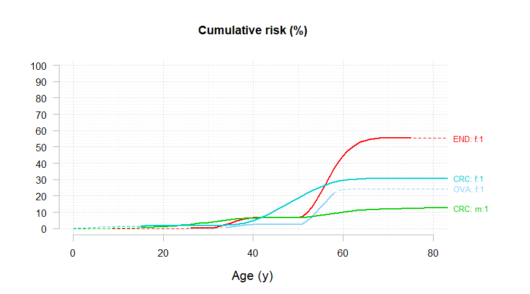
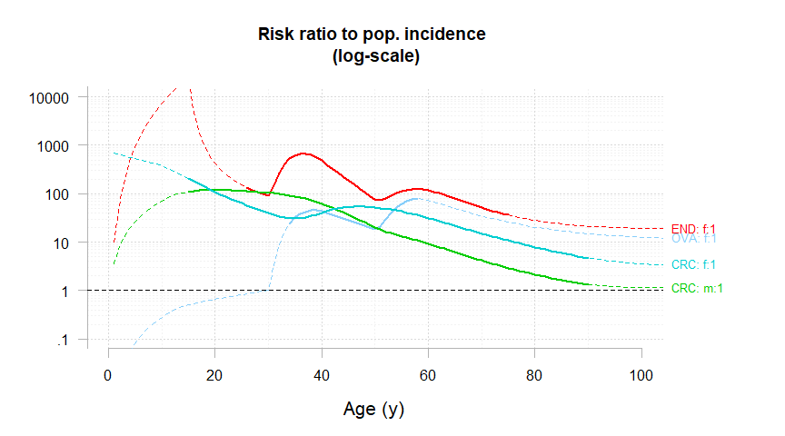

<!-- README.md is generated from README.Rmd. Please edit that file -->

# generisk <a href="https://github.com/youenndrouet/generisk"></a>

<!-- badges: start -->
<!-- badges: end -->

## Overview

The goal of generisk is to perform estimation of the Genotype Restricted
Likelihood (GRL) from family data.

The main function is `generisk()`.

## Installation

You can install the development version of `generisk` like so:

``` r
# install.packages("pak")
pak::pak("youenndrouet/generisk")
```

## Example

This is a basic example which shows you how to use generisk on a dataset
of 236 Lynch Syndrome french families with MLH1 mutations. The first
analysis of the full dataset comprising 537 families with the GRL method
is published here (Bonadona et al. JAMA 2011)
<https://jamanetwork.com/journals/jama/fullarticle/900645>.

``` r
library(generisk) # load the generisk package
```

The generisk package comes with the `eriscam_mlh1` dataset. First step
is to format this dataset to comply with `generisk`. This data
manipulation is done using the `dplyr` package. As you can see, sex has
to be recoded 1:male, 0:female and each phenotype (in our case cancer
site) must be described by an “event” variable and a “time” (age)
variable, just as in any “survival-like” modeling strategy. Censoring is
performed at first colonoscopy and preventive surgeries.

``` r
library(dplyr) # load the dplyr package to manipulate the data
#> Warning: le package 'dplyr' a été compilé avec la version R 4.2.3
#> 
#> Attachement du package : 'dplyr'
#> Les objets suivants sont masqués depuis 'package:stats':
#> 
#>     filter, lag
#> Les objets suivants sont masqués depuis 'package:base':
#> 
#>     intersect, setdiff, setequal, union

dat_GRL <- eriscam_mlh1 %>%
   mutate(SEX_recoded = if_else(SEX == 1, 1, 0),
         CRC_event = if_else(!is.na(COLORECTUM),
                             if_else(!is.na(FIRST_COLONOSCOPY), 
                                    if_else(COLORECTUM < FIRST_COLONOSCOPY, 
                                            1, 
                                            0),
                                    1), 
                             0),
         CRC_age = if_else(!is.na(COLORECTUM),
                             if_else(!is.na(FIRST_COLONOSCOPY), 
                                    if_else(COLORECTUM < FIRST_COLONOSCOPY, 
                                            COLORECTUM, 
                                            FIRST_COLONOSCOPY),
                                    AGE_AT_LAST_NEWS), 
                             AGE_AT_LAST_NEWS),
         
         END_event = if_else(!is.na(ENDOMETRIUM),
                             if_else(!is.na(HYSTERECTOMY), 
                                    if_else(ENDOMETRIUM < HYSTERECTOMY, 
                                            1, 
                                            0),
                                    1), 
                             0),
         END_age = if_else(!is.na(ENDOMETRIUM),
                             if_else(!is.na(HYSTERECTOMY), 
                                    if_else(ENDOMETRIUM < HYSTERECTOMY, 
                                            ENDOMETRIUM, 
                                            HYSTERECTOMY),
                                    AGE_AT_LAST_NEWS), 
                             AGE_AT_LAST_NEWS),
         OVA_event = if_else(!is.na(OVARY),
                             if_else(!is.na(OOPHORECTOMY), 
                                    if_else(OVARY < OOPHORECTOMY, 
                                            1, 
                                            0),
                                    1), 
                             0),
         OVA_age = if_else(!is.na(OVARY),
                             if_else(!is.na(OOPHORECTOMY), 
                                    if_else(OVARY < OOPHORECTOMY, 
                                            OVARY, 
                                            OOPHORECTOMY),
                                    AGE_AT_LAST_NEWS), 
                             AGE_AT_LAST_NEWS)
         )

wi_colectomy <- which(!is.na(dat_GRL$TOTAL_COLECTOMY))
dat_GRL$CRC_age[wi_colectomy] <- dat_GRL$TOTAL_COLECTOMY[wi_colectomy]
```

Then we create another dataset selecting the columns required for
`generisk` (warning: column order is important).

``` r
dat_MLH1 <- dat_GRL %>% 
   select(FAMILY_ID, PERSON_ID, SEX_recoded, FATHER_ID, MOTHER_ID, PROBAND_FLAG, MLH1_STATUS, CRC_event, CRC_age, END_event, END_age, OVA_event, OVA_age)
```

Then, we have to compute, for each cancer site, the cumulative incidence
by age. The FRANCIM incidence data are used (available at
<https://www.santepubliquefrance.fr/maladies-et-traumatismes/cancers/cancer-du-sein/documents/rapport-synthese/estimations-nationales-de-l-incidence-et-de-la-mortalite-par-cancer-en-france-metropolitaine-entre-1990-et-2018-volume-1-tumeurs-solides-etud>).

``` r
# Populational incidence data for 100,000 individuals (ref: FRANCIM 2018)
# at age classes : 
# [0;14] [15;19] [20;24] [25;29] [30;34] [35;39] [40;44] [45;49] [50;54] 
# [55;59] [60;64] [65;69] [70;74] [75;79] [80;84] [85;89] [90;94] [95;+]

# colorectal cancer

CRCm <- c(0.3, 0.9, 1.7, 3.1, 4.9, 7.3, 12.7, 25.3, 49.8, 86.2, 136.6, 199.9, 261.8, 327.9, 414.1, 503.8, 480.3, 335.0)
CRCf <- c(0.4, 1.7, 2.5, 3.2, 4.5, 8.3, 15.8, 27.3, 43.1, 62.8, 88.5, 121.8, 157.8, 200.9, 256.4, 315.5, 320.3, 257.5)

# endometrium
ENDf <- c(0, 0, 0.1, 0.3, 0.6, 1.4, 3.3, 8.2, 18.4, 33.4, 53.8, 77.6, 93.4, 92.6, 77.5, 57.2, 37.6, 23.2)

## ovary
OVAf <- c(0.4, 1.1, 1.4, 1.6, 2.0, 3.1, 5.2, 8.8, 14.1, 20.8, 29.7, 40.6, 48.7, 51.2, 49.0, 43.9, 36.1, 27.4)
```

Since `generisk` requires that incidence data are given by age (1:120)
and sex. The following code transforms incidence data by age group and
per 100,000 individuals into smoothed cumulative risks. Then, we create
a list named `myFt` combining these cumulative risks representing the
cancer risks in the French general population.

``` r

rates_by1year_0to120 <- function(rates_byclasses){
    out <- c(0, # rates at age = 0 is 0
             rep(rates_byclasses[1],14), # ages = 1 to 14 
             rep(rates_byclasses[2:17],each = 5), # 5-year age classes from 15 to 94
             rep(rates_byclasses[18],26) # ages = 95 to 120  
             )
    return(out)
}

CRCm.rates <- rates_by1year_0to120(CRCm)
CRCf.rates <- rates_by1year_0to120(CRCf)
OVAf.rates <- rates_by1year_0to120(OVAf)
ENDf.rates <- rates_by1year_0to120(ENDf)

Ft.CRC.smo <- cbind("m"=Ft_compute(CRCm.rates), "f" = Ft_compute(CRCf.rates))
Ft.END.smo <- cbind("m"=rep(0,121), "f" = Ft_compute(ENDf.rates))
Ft.OVA.smo <- cbind("m"=rep(0,121), "f" = Ft_compute(OVAf.rates))

Ft.CRC <- cbind("m"=Ft_compute(CRCm.rates, smo = FALSE), "f" = Ft_compute(CRCf.rates, smo = FALSE))
Ft.END <- cbind("m"=rep(0,121), "f" = Ft_compute(ENDf.rates, smo = FALSE))
Ft.OVA <- cbind("m"=rep(0,121), "f" = Ft_compute(OVAf.rates, smo = FALSE))

ddinc <- tibble(age  = rep(1:80,2),
                sexe = rep(c("f","m"), each = 80),
                CRC = c(Ft.CRC[2:81,"f"],Ft.CRC[2:81,"m"]),
                END = c(Ft.END[2:81,"f"],Ft.END[2:81,"m"]),
                OVA = c(Ft.OVA[2:81,"f"],Ft.OVA[2:81,"m"]),
                CRC.smo = c(Ft.CRC.smo[2:81,"f"],Ft.CRC.smo[2:81,"m"]),
                END.smo = c(Ft.END.smo[2:81,"f"],Ft.END.smo[2:81,"m"]),
                OVA.smo = c(Ft.OVA.smo[2:81,"f"],Ft.OVA.smo[2:81,"m"])
                )

library(ggplot2)
#> Warning: le package 'ggplot2' a été compilé avec la version R 4.2.3

plotinc <- ddinc %>%
  tidyr::gather(key = "Cancer", value = "CumPopInc", CRC, END, OVA, CRC.smo, END.smo, OVA.smo) %>%
  filter(CumPopInc>0) %>%
  ggplot(aes(x = age, y = CumPopInc, color = Cancer, linetype = Cancer)) +
  geom_line() +
  scale_y_continuous(trans = "log10")+
  scale_color_manual(values = c(OVA = "#87CEFA",
                                END = "#FF0000",
                                CRC = "#00CD00",
                                OVA.smo = "#87CEFA",
                                END.smo = "#FF0000",
                                CRC.smo = "#00CD00"
                                ))+
  scale_linetype_manual(values = c(OVA = 1,
                                END = 1,
                                CRC = 1,
                                OVA.smo = 4,
                                END.smo = 4,
                                CRC.smo = 4
                                ))+
  facet_wrap(vars(sexe)) +
  theme_bw()

plotinc
```


``` r


myFt <- list("CCR" = Ft.CRC.smo, "END" = Ft.END.smo, "OVA" = Ft.OVA.smo)
```

The next step is to define other parameters required by `generisk`. This
is done through a list of parameters defined for each cancer site.

``` r
myParams_NP <- list(
  
  "CRC" = list(
    penet.model   = "np",
    agenodes = c(30,40,50,60,70),
    inheritance   = "dominant",
    implic.loci   = TRUE,
    gender.effect = TRUE),
  
  "END" = list(
    penet.model   = "np",
    agenodes = c(30,40,50,60,70),
    inheritance   = "dominant",
    implic.loci   = TRUE,
    gender.effect = TRUE),
  
  "OVA" = list(
    penet.model   = "np",
    agenodes = c(30,40,50,60,70),
    inheritance   = "dominant",
    implic.loci   = TRUE,
    gender.effect = TRUE)
)
```

Then we run the `generisk` program using these parameters. Calculations
will be performed using 4 cores. The frequency of the mutations in MLH1
in the general population is assumed to be 1/1946 (cf
<https://www.ncbi.nlm.nih.gov/pmc/articles/PMC5336409/pdf/nihms827219.pdf>)

``` r
estim_NP <- generisk(Ft.pop = myFt,
                          FIT.pars = myParams_NP,
                          fA = 1/1946, 
                          DATA = as.data.frame(dat_MLH1),
                          B = 0,
                          multi.pheno = "all",
                          imput_missing_age_last_news = FALSE, 
                          ncores = 4)
#>  ________________________________________
#>                                          
#>   The generisk R program 
#>   version: 0.1.0 
#>                                         
#>   Number of families:  236 
#>    - CRC_event :  783 / 783  affected individuals will be analyzed 
#>    - END_event :  70 / 70  affected individuals will be analyzed 
#>    - OVA_event :  29 / 29  affected individuals will be analyzed 
#>    - Unaffected individuals: 1418 / 3886  individuals with missing age at last news removed from analysis (age --> 0) 
#> 
#> Parallel computing using 4 / 8 available cores. 
#>   -> Program initialization. 
#>   -> Pre-calculations to speed-up likelihood algorithm. 
#>   -> ML optimization by nlminb. 
#>   0:     697.36739: -7.90240 -7.32511 -6.08231 -4.87152 -4.03744 -1.81097 -7.69232 -7.18030 -6.02310 -5.16432 -4.50888 -2.13868 -10.6159 -9.06685 -7.21597 -5.81725 -4.96980 -3.79609 -8.19535 -8.15298 -7.14315 -6.26111 -5.59995 -4.02964
#>   1:     567.95775: -6.73629 -6.30674 -4.39906 -3.71890 -2.82445 -1.77724 -6.53948 -6.26307 -4.34619 -4.07379 -3.44589 -2.06517 -10.4835 -8.82559 -6.80874 -5.26447 -4.71520 -3.76808 -8.09930 -8.06677 -7.00821 -6.14239 -5.59200 -4.02450
#>   2:     536.87738: -5.44765 -6.56272 -3.07003 -3.60465 -2.79934 -1.81097 -5.10199 -5.95973 -2.25387 -3.66852 -3.43400 -1.94212 -10.0752 -8.02670 -5.86766 -4.60960 -4.51015 -3.75309 -7.80102 -7.84539 -6.87336 -5.72535 -5.55086 -4.00837
#>   3:     532.74499: -4.31201 -7.25149 -1.54437 -3.73786 -2.05877 -1.81097 -5.43362 -6.60827 -0.498011 -4.40940 -3.82547 -2.02661 -9.27974 -6.46282 -5.72690 -2.88893 -4.43560 -3.74433 -7.35661 -7.55933 -6.87171 -5.05502 -5.47256 -4.01147
#>   4:     529.35226: -4.29333 -7.25175 -1.65500 -3.74545 -2.05953 -1.81097 -5.39444 -6.60853 -1.54962 -4.41641 -3.82730 -2.02788 -9.25356 -6.42136 -5.69493 -2.83290 -4.42969 -3.74432 -7.35054 -7.55587 -6.86603 -5.02574 -5.47246 -4.01142
#>   5:     527.24671: -4.14605 -7.25984 -2.25788 -3.77420 -2.00105 -1.81097 -5.03614 -6.59468 -1.51033 -4.43800 -3.77484 -2.02778 -9.02496 -6.06769 -5.52621 -2.25343 -4.37207 -3.74288 -7.29313 -7.52247 -6.82225 -4.79536 -5.44919 -4.01151
#>   6:     525.30327: -3.92622 -7.32511 -2.31380 -3.78973 -1.82664 -1.81097 -4.82286 -6.63442 -1.19051 -4.50452 -3.76725 -2.03040 -8.78665 -5.67960 -5.37768 -1.58993 -4.32217 -3.74161 -7.22073 -7.47812 -6.78615 -4.54439 -5.42525 -4.01165
#>   7:     524.85351: -3.90925 -7.32453 -2.33344 -3.78665 -1.77731 -1.81097 -4.79151 -6.62856 -1.13635 -4.50130 -3.75421 -2.02962 -8.73433 -5.61040 -5.34394 -1.35548 -4.30985 -3.74173 -7.21520 -7.47539 -6.77460 -4.46876 -5.42097 -4.01163
#>   8:     524.13838: -3.87306 -7.32323 -2.37179 -3.78107 -1.67400 -1.81097 -4.74545 -6.61792 -1.23688 -4.49845 -3.73198 -2.02961 -8.62564 -5.46814 -5.28026 -0.889843 -4.28717 -3.74204 -7.20230 -7.46912 -6.75120 -4.30393 -5.41324 -4.01159
#>   9:     523.58241: -3.61440 -7.32511 -2.46084 -3.80155 -1.30689 -1.81097 -4.61549 -6.66144 -1.29286 -4.61437 -3.71193 -2.04548 -8.11859 -4.72204 -5.09897 -0.641530 -4.23882 -3.74224 -7.04962 -7.38588 -6.66764 -3.49392 -5.39340 -4.01258
#>  10:     523.16307: -3.42285 -7.32511 -2.54237 -3.82776 -1.02708 -1.81097 -4.50488 -6.71614 -1.29043 -4.73909 -3.66878 -2.05912 -7.56209 -3.93360 -4.91128 -0.870720 -4.17827 -3.74233 -6.90497 -7.30656 -6.58888 -2.66559 -5.37212 -4.01373
#>  11:     522.95927: -3.74457 -7.32511 -2.58343 -3.77084 -1.67050 -1.81097 -4.47543 -6.58763 -1.25849 -4.66639 -3.40380 -2.04886 -7.11103 -3.48515 -4.80901 -0.967561 -4.10260 -3.74336 -6.86931 -7.29443 -6.51488 -1.88505 -5.36671 -4.01525
#>  12:     522.84508: -3.80783 -7.32511 -2.56655 -3.76750 -1.52008 -1.81097 -4.56027 -6.56663 -1.31428 -4.65603 -3.40218 -2.03698 -7.23866 -3.87906 -4.87917 -0.971176 -4.10501 -3.74524 -6.95044 -7.34010 -6.54099 -2.28188 -5.36938 -4.01514
#>  13:     522.77776: -3.77699 -7.32511 -2.58882 -3.78294 -1.29298 -1.81097 -4.59117 -6.54108 -1.30744 -4.69657 -3.32515 -2.02700 -7.10600 -3.89194 -4.89226 -0.936109 -4.06949 -3.74780 -6.98437 -7.36267 -6.53663 -2.17728 -5.36636 -4.01595
#>  14:     522.74666: -3.73792 -7.32511 -2.60100 -3.81077 -1.27529 -1.81097 -4.59653 -6.49745 -1.29610 -4.73517 -3.19721 -2.01650 -6.93570 -3.86026 -4.90639 -0.944015 -4.02351 -3.75039 -7.01735 -7.38660 -6.52653 -2.05823 -5.36154 -4.01716
#>  15:     522.70542: -3.68197 -7.32511 -2.64250 -3.93517 -1.24180 -1.81097 -4.61306 -6.27531 -1.29404 -4.89300 -2.60012 -1.96876 -6.26060 -3.83544 -4.99512 -0.996638 -3.81362 -3.76261 -7.20112 -7.51756 -6.48963 -1.72260 -5.34106 -4.02263
#>  16:     522.66468: -3.67852 -7.32511 -2.63049 -3.96374 -1.25923 -1.81097 -4.60524 -6.21010 -1.30007 -4.92076 -2.54519 -1.89628 -6.19142 -3.90205 -5.03970 -1.01213 -3.76677 -3.76538 -7.26211 -7.56091 -6.49159 -1.85489 -5.33837 -4.02392
#>  17:     522.60831: -3.73484 -7.32511 -2.62472 -4.05398 -1.25536 -1.81097 -4.58300 -5.94459 -1.35562 -5.01908 -2.29268 -1.64301 -5.81840 -3.99309 -5.15545 -1.04227 -3.56174 -3.77604 -7.47101 -7.71562 -6.47418 -1.94884 -5.32521 -4.02885
#>  18:     522.56408: -3.78549 -7.32511 -2.58859 -4.22331 -1.23649 -1.81097 -4.57800 -5.33382 -1.43701 -5.16432 -1.97642 -1.08378 -5.17099 -4.11349 -5.38275 -1.03583 -3.09494 -3.79609 -7.89993 -8.05003 -6.42802 -2.09409 -5.30025 -4.02964
#>  19:     522.54696: -3.76352 -7.32495 -2.59456 -4.16557 -1.23155 -1.81097 -4.58348 -5.51831 -1.39062 -5.11608 -2.13425 -1.27890 -5.39728 -4.07170 -5.30931 -1.02929 -3.23978 -3.79609 -7.76424 -7.94251 -6.44032 -2.05148 -5.31977 -4.02964
#>  20:     522.50681: -3.76056 -7.32482 -2.56558 -4.20730 -1.20080 -1.81097 -4.59984 -5.25476 -1.36545 -5.15402 -2.24624 -1.13877 -5.24003 -4.08616 -5.37786 -0.977509 -3.05122 -3.79609 -7.91846 -8.07325 -6.41801 -2.06154 -5.30472 -4.02964
#>  21:     522.46706: -3.77495 -7.32511 -2.54839 -4.23715 -1.24385 -1.81097 -4.62729 -4.97141 -1.39942 -5.16432 -2.35679 -0.999624 -5.12917 -4.07988 -5.43759 -0.977404 -2.85560 -3.79609 -8.07681 -8.15298 -6.39676 -2.11223 -5.29216 -4.02964
#>  22:     522.46115: -3.76813 -7.29358 -2.53890 -4.27147 -1.39670 -1.81097 -4.78222 -4.30953 -1.45758 -5.16432 -2.71529 -0.795795 -5.05904 -3.91267 -5.52684 -1.01789 -2.40084 -3.79609 -8.19535 -8.15298 -6.26890 -2.17434 -5.27286 -4.02964
#>  23:     522.43295: -3.77602 -7.31896 -2.54047 -4.23074 -1.31901 -1.81097 -4.70416 -4.63179 -1.41339 -5.16432 -2.55056 -0.883998 -5.20758 -3.98010 -5.48713 -1.01188 -2.60282 -3.79609 -8.19535 -8.15298 -6.37393 -2.16114 -5.27490 -4.02964
#>  24:     522.41630: -3.75014 -7.28732 -2.56368 -4.27652 -1.25295 -1.81097 -4.80259 -4.30879 -1.33274 -5.16432 -2.53547 -0.893475 -5.16686 -3.95737 -5.55360 -1.09321 -2.30169 -3.79609 -8.19535 -8.15298 -6.39860 -2.13827 -5.28579 -4.02964
#>  25:     522.40124: -3.75525 -7.29950 -2.56890 -4.25757 -1.21950 -1.81097 -4.73287 -4.50019 -1.37994 -5.16432 -2.48886 -0.941654 -5.24078 -3.96576 -5.52612 -1.05597 -2.42854 -3.79609 -8.19535 -8.15298 -6.40798 -2.12043 -5.30601 -4.02964
#>  26:     522.39299: -3.75286 -7.28609 -2.57248 -4.27915 -1.21686 -1.81097 -4.71553 -4.44256 -1.40231 -5.15378 -2.48450 -0.953456 -5.22801 -3.94224 -5.54750 -1.06947 -2.31926 -3.79609 -8.19535 -8.15298 -6.37701 -2.09307 -5.33194 -4.02964
#>  27:     522.38913: -3.74599 -7.28035 -2.57729 -4.28130 -1.22253 -1.81097 -4.70387 -4.47080 -1.39171 -5.14409 -2.43807 -1.01403 -5.25493 -3.95021 -5.54679 -1.07171 -2.34578 -3.79609 -8.19535 -8.15298 -6.38394 -2.05741 -5.35396 -4.02964
#>  28:     522.38784: -3.73958 -7.26562 -2.58491 -4.29201 -1.22208 -1.81097 -4.69077 -4.47693 -1.38438 -5.12954 -2.37762 -1.09455 -5.29045 -3.95467 -5.55499 -1.08442 -2.33433 -3.79609 -8.19535 -8.15298 -6.38307 -2.01071 -5.38709 -4.02964
#>  29:     522.38450: -3.73928 -7.24625 -2.59230 -4.30367 -1.21599 -1.81097 -4.68360 -4.46963 -1.39515 -5.12228 -2.32139 -1.18068 -5.33772 -3.95551 -5.56355 -1.09482 -2.34375 -3.79609 -8.19535 -8.15298 -6.37232 -1.97877 -5.41653 -4.02964
#>  30:     522.38258: -3.73989 -7.19942 -2.59569 -4.32873 -1.20911 -1.81097 -4.69061 -4.39764 -1.42359 -5.12519 -2.26372 -1.34996 -5.42974 -3.93843 -5.58380 -1.10766 -2.36307 -3.79609 -8.19535 -8.15298 -6.33776 -1.94763 -5.45535 -4.02964
#>  31:     522.38168: -3.75291 -7.20949 -2.58253 -4.32215 -1.21728 -1.81097 -4.70683 -4.34607 -1.43354 -5.14500 -2.36251 -1.23885 -5.39481 -3.93336 -5.58399 -1.09699 -2.36228 -3.79609 -8.19535 -8.15298 -6.32685 -2.00764 -5.41544 -4.02964
#>  32:     522.37941: -3.74243 -7.21241 -2.58062 -4.31817 -1.21596 -1.81097 -4.70035 -4.38166 -1.41311 -5.15071 -2.33760 -1.24231 -5.38629 -3.92637 -5.58075 -1.08976 -2.35910 -3.79609 -8.19535 -8.15298 -6.35196 -1.99636 -5.41338 -4.02964
#>  33:     522.37838: -3.74545 -7.19450 -2.57769 -4.32283 -1.21598 -1.81097 -4.70065 -4.36766 -1.41319 -5.16217 -2.32231 -1.28365 -5.41225 -3.91241 -5.58723 -1.08786 -2.36905 -3.79609 -8.19535 -8.15298 -6.35192 -1.99649 -5.41436 -4.02964
#>  34:     522.37738: -3.75200 -7.16473 -2.57506 -4.33237 -1.21671 -1.81097 -4.70016 -4.34878 -1.41664 -5.16432 -2.29821 -1.34851 -5.45036 -3.89600 -5.59782 -1.08975 -2.37110 -3.79609 -8.19535 -8.15298 -6.34628 -1.99275 -5.41944 -4.02964
#>  35:     522.37712: -3.75179 -7.17467 -2.57485 -4.32852 -1.21735 -1.81097 -4.70136 -4.35114 -1.41831 -5.16432 -2.32118 -1.30396 -5.43127 -3.90136 -5.59521 -1.08916 -2.36384 -3.79609 -8.19535 -8.15298 -6.34555 -2.00438 -5.41124 -4.02964
#>  36:     522.37670: -3.75271 -7.16201 -2.57361 -4.33094 -1.21721 -1.81097 -4.70148 -4.34998 -1.41859 -5.16432 -2.32016 -1.31202 -5.44119 -3.89483 -5.59957 -1.08931 -2.35745 -3.79609 -8.19535 -8.15298 -6.34539 -2.00929 -5.40781 -4.02964
#> 
#>   job done !
```

36 iterations are required to reach a -log(LKL) of 522.37670.

The `plot_generisk` function is useful to see the estimated penetrance
curves.

``` r
plot_generisk(estim_NP)
```



``` r
plot_generisk(estim_NP, type ="relative")
```



And estimations can be extracted using the `summarize_generisk`
function.

``` r
summarize_generisk(estim_NP, ages = c(30,50,70))
#> 
#> Model overall statistics: 
#>  -2logL= 1044.8 with 24 parameters (AIC= 1092.8)
#>  relative convergence (4) 
#> 
#> Estimated risks:
#> $ABSOLUTE_CUM_RISKS
#>      strata                                   Age=30 Age=50 Age=70
#> [1,] "OVA: f:1 (NP nodes at: 30/40/50/60/70)" "0"    "0.2"  "14.1"
#> [2,] "END: f:1 (NP nodes at: 30/40/50/60/70)" "0.4"  "2.8"  "45.9"
#> [3,] "CRC: m:1 (NP nodes at: 30/40/50/60/70)" "2.3"  "10"   "41"  
#> [4,] "CRC: f:1 (NP nodes at: 30/40/50/60/70)" "0.9"  "26.4" "36.8"
#> 
#> $RELATIVE_CUM_RISKS
#>      strata                                   Age=30  Age=50 Age=70
#> [1,] "OVA: f:1 (NP nodes at: 30/40/50/60/70)" "1"     "1.7"  "20.3"
#> [2,] "END: f:1 (NP nodes at: 30/40/50/60/70)" "184.3" "32.6" "42.6"
#> [3,] "CRC: m:1 (NP nodes at: 30/40/50/60/70)" "63.6"  "30.4" "14.3"
#> [4,] "CRC: f:1 (NP nodes at: 30/40/50/60/70)" "19.9"  "72.6" "18.1"
```

In the above code we do the same analysis but assuming a Weibull shape
for the penetrance curve.

``` r

myParams_Weibull <- list(
  
  "CRC" = list(
    penet.model   = "Weibull",
    inheritance   = "dominant",
    implic.loci   = TRUE,
    gender.effect = TRUE),
  
  "END" = list(
    penet.model   = "Weibull",
    inheritance   = "dominant",
    implic.loci   = TRUE,
    gender.effect = TRUE),
  
  "OVA" = list(
    penet.model   = "Weibull",
    inheritance   = "dominant",
    implic.loci   = TRUE,
    gender.effect = TRUE)
)
```

``` r
estim_Weibull <- generisk(Ft.pop = myFt,
                          FIT.pars = myParams_Weibull,
                          fA = 1/1946, 
                          DATA = as.data.frame(dat_MLH1),
                          B = 0,
                          multi.pheno = "all",
                          imput_missing_age_last_news = FALSE, 
                          ncores = 4)
#>  ________________________________________
#>                                          
#>   The generisk R program 
#>   version: 0.1.0 
#>                                         
#>   Number of families:  236 
#>    - CRC_event :  783 / 783  affected individuals will be analyzed 
#>    - END_event :  70 / 70  affected individuals will be analyzed 
#>    - OVA_event :  29 / 29  affected individuals will be analyzed 
#>    - Unaffected individuals: 1418 / 3886  individuals with missing age at last news removed from analysis (age --> 0) 
#> 
#> Parallel computing using 4 / 8 available cores. 
#>   -> Program initialization. 
#>   -> Pre-calculations to speed-up likelihood algorithm. 
#>   -> ML optimization by nlminb. 
#>   0:     678.19668: 0.188841 0.992597 0.846142 0.144427 0.991560 0.860595 0.0309503 0.986142 0.669495 0.0238533 0.974509 0.725334
#>   1:     551.62755: 0.621245 0.992597 0.846142 0.708062 0.991560 0.860595 0.686346 0.986142 0.669495 0.280368 0.974509 0.725334
#>   2:     545.68606: 0.782732 0.992597 0.846142 0.818150 0.991560 0.860595 0.673825 0.986142 0.687404 0.277751 0.974509 0.726817
#>   3:     540.58093: 0.999000 0.992597 0.846142 0.999000 0.991560 0.860595 0.384630 0.986142 0.669495 0.326700 0.974509 0.725334
#>   4:     540.32602: 0.999000 0.992597 0.846142 0.999000 0.991560 0.860595 0.589682 0.986142 0.669495 0.387597 0.974509 0.725334
#>   5:     540.32594: 0.999000 0.992597 0.846142 0.999000 0.991560 0.860595 0.588353 0.986142 0.669495 0.382887 0.974509 0.725334
#>   6:     540.32594: 0.999000 0.992597 0.846142 0.999000 0.991560 0.860595 0.588353 0.986142 0.669495 0.382887 0.974509 0.725334
#> 
#>   job done !
```

Only 6 iterations are needed to reach convergence, but the -log(LKL) is
higher compared to previous estimation: 540.32594 indicating a lower fit
to the data.

As you can see, risk estimate are quite different indicating that the
shape of the curves (Weibull or non parametric using age nodes) is an
important modeling choice.

``` r
plot_generisk(estim_Weibull)
```


These two models can be compared formally using a likelihood ratio test,
taking into account the different numbers of parameters between the
models (24p for the NP model vs 12p for the Weibull model).

``` r
compareModels(estim_NP, estim_Weibull)
#> $lr
#> [1] 35.89847
#> 
#> $pvalue
#> [1] 0.0003363933
```

This test indicates that the non parametric estimation with age nodes at
30,40,50,60,70 better fits the data compared to the Weibull model
(p-value \< 0.001).
