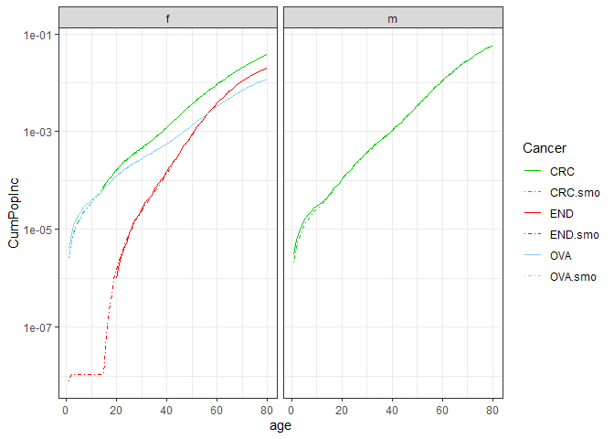
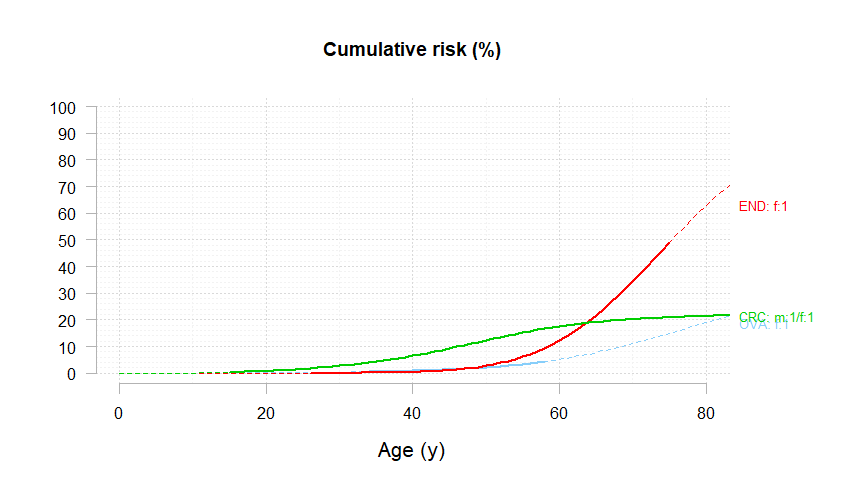
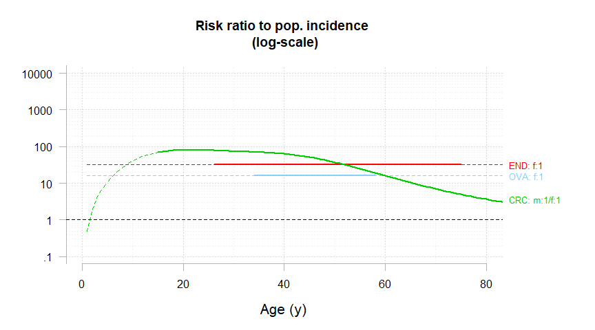
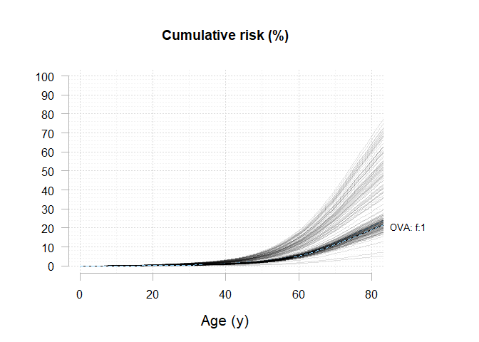
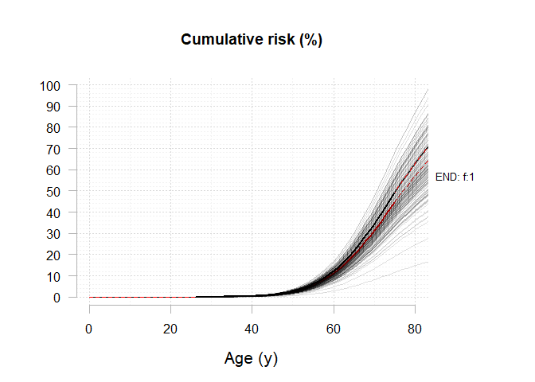
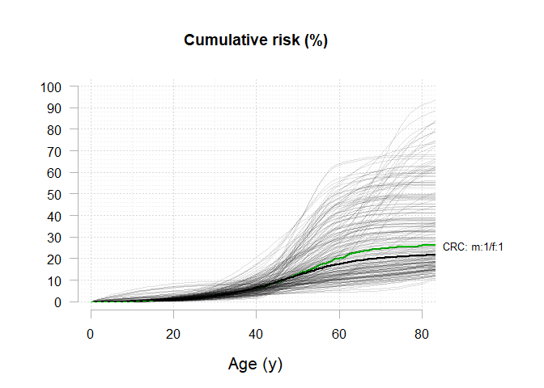

<!-- README.md is generated from README.Rmd. Please edit that file -->

# generisk <a href="https://github.com/youenndrouet/generisk"></a>

<!-- badges: start -->

<!-- badges: end -->

## Overview

The goal of generisk is to perform estimation of the Genotype Restricted
Likelihood (GRL) from family data.

The main function is `generisk()`.

## Installation

You can install the development version of `generisk` like so:

``` r
# install.packages("pak")
pak::pak("youenndrouet/generisk")
```

## Example

This is a basic example which shows you how to use generisk on a dataset
of 236 Lynch Syndrome french families with MLH1 mutations. The first
analysis of the full dataset comprising 537 families with the GRL method
is published here (Bonadona et al. JAMA 2011)
<https://jamanetwork.com/journals/jama/fullarticle/900645>.

``` r
library(generisk) # load the generisk package
```

The generisk package comes with the `eriscam_mlh1` dataset. First step
is to format this dataset to comply with `generisk`. This data
manipulation is done using the `dplyr` package. As you can see, sex has
to be recoded 1:male, 0:female and each phenotype (in our case cancer
site) must be described by an “event” variable and a “time” (age)
variable, just as in any “survival-like” modeling strategy. Censoring is
performed at first colonoscopy and preventive surgeries.

``` r
library(dplyr) # load the dplyr package to manipulate the data
#> 
#> Attachement du package : 'dplyr'
#> Les objets suivants sont masqués depuis 'package:stats':
#> 
#>     filter, lag
#> Les objets suivants sont masqués depuis 'package:base':
#> 
#>     intersect, setdiff, setequal, union

dat_GRL <- eriscam_mlh1 %>%
   mutate(SEX_recoded = if_else(SEX == 1, 1, 0),
         CRC_event = if_else(!is.na(COLORECTUM),
                             if_else(!is.na(FIRST_COLONOSCOPY), 
                                    if_else(COLORECTUM < FIRST_COLONOSCOPY, 
                                            1, 
                                            0),
                                    1), 
                             0),
         CRC_age = if_else(!is.na(COLORECTUM),
                             if_else(!is.na(FIRST_COLONOSCOPY), 
                                    if_else(COLORECTUM < FIRST_COLONOSCOPY, 
                                            COLORECTUM, 
                                            FIRST_COLONOSCOPY),
                                    COLORECTUM),
                           if_else(!is.na(FIRST_COLONOSCOPY), 
                                   FIRST_COLONOSCOPY,
                                   AGE_AT_LAST_NEWS)
                           ),
         
         END_event = if_else(!is.na(ENDOMETRIUM),
                             if_else(!is.na(HYSTERECTOMY), 
                                    if_else(ENDOMETRIUM < HYSTERECTOMY, 
                                            1, 
                                            0),
                                    1), 
                             0),
         END_age = if_else(!is.na(ENDOMETRIUM),
                             if_else(!is.na(HYSTERECTOMY), 
                                    if_else(ENDOMETRIUM < HYSTERECTOMY, 
                                            ENDOMETRIUM, 
                                            HYSTERECTOMY),
                                    ENDOMETRIUM),
                           if_else(!is.na(HYSTERECTOMY), 
                                   HYSTERECTOMY,
                                   AGE_AT_LAST_NEWS)
                           ),
           
         OVA_event = if_else(!is.na(OVARY),
                             if_else(!is.na(OOPHORECTOMY), 
                                    if_else(OVARY < OOPHORECTOMY, 
                                            1, 
                                            0),
                                    1), 
                             0),
         OVA_age = if_else(!is.na(OVARY),
                             if_else(!is.na(OOPHORECTOMY), 
                                    if_else(OVARY < OOPHORECTOMY, 
                                            OVARY, 
                                            OOPHORECTOMY),
                                    OVARY),
                           if_else(!is.na(OOPHORECTOMY), 
                                   OOPHORECTOMY,
                                   AGE_AT_LAST_NEWS)
                           )
         )

wi_colectomy <- which(!is.na(dat_GRL$TOTAL_COLECTOMY))
dat_GRL$CRC_age[wi_colectomy] <- dat_GRL$TOTAL_COLECTOMY[wi_colectomy]
```

Then we create another dataset selecting the columns required for
`generisk` (warning: column order is important).

``` r
dat_MLH1 <- dat_GRL %>% 
   select(FAMILY_ID, PERSON_ID, SEX_recoded, FATHER_ID, MOTHER_ID, PROBAND_FLAG, MLH1_STATUS, CRC_event, CRC_age, END_event, END_age, OVA_event, OVA_age)
```

Then, we have to compute, for each cancer site, the cumulative incidence
by age. The FRANCIM incidence data are used (available at
<https://www.santepubliquefrance.fr/maladies-et-traumatismes/cancers/cancer-du-sein/documents/rapport-synthese/estimations-nationales-de-l-incidence-et-de-la-mortalite-par-cancer-en-france-metropolitaine-entre-1990-et-2018-volume-1-tumeurs-solides-etud>).

``` r
# Populational incidence data for 100,000 individuals (ref: FRANCIM 2018)
# at age classes : 
# [0;14] [15;19] [20;24] [25;29] [30;34] [35;39] [40;44] [45;49] [50;54] 
# [55;59] [60;64] [65;69] [70;74] [75;79] [80;84] [85;89] [90;94] [95;+]

# colorectal cancer

CRCm <- c(0.3, 0.9, 1.7, 3.1, 4.9, 7.3, 12.7, 25.3, 49.8, 86.2, 136.6, 199.9, 261.8, 327.9, 414.1, 503.8, 480.3, 335.0)
CRCf <- c(0.4, 1.7, 2.5, 3.2, 4.5, 8.3, 15.8, 27.3, 43.1, 62.8, 88.5, 121.8, 157.8, 200.9, 256.4, 315.5, 320.3, 257.5)

# endometrium
ENDf <- c(0, 0, 0.1, 0.3, 0.6, 1.4, 3.3, 8.2, 18.4, 33.4, 53.8, 77.6, 93.4, 92.6, 77.5, 57.2, 37.6, 23.2)

## ovary
OVAf <- c(0.4, 1.1, 1.4, 1.6, 2.0, 3.1, 5.2, 8.8, 14.1, 20.8, 29.7, 40.6, 48.7, 51.2, 49.0, 43.9, 36.1, 27.4)
```

Since `generisk` requires that incidence data are given by age (1:120)
and sex. The following code transforms incidence data by age group and
per 100,000 individuals into smoothed cumulative risks. Then, we create
a list named `myFt` combining these cumulative risks representing the
cancer risks in the French general population.

``` r
rates_by1year_0to120 <- function(rates_byclasses){
    out <- c(0, # rates at age = 0 is 0
             rep(rates_byclasses[1],14), # ages = 1 to 14 
             rep(rates_byclasses[2:17],each = 5), # 5-year age classes from 15 to 94
             rep(rates_byclasses[18],26) # ages = 95 to 120  
             )
    return(out)
}

CRCm.rates <- rates_by1year_0to120(CRCm)
CRCf.rates <- rates_by1year_0to120(CRCf)
OVAf.rates <- rates_by1year_0to120(OVAf)
ENDf.rates <- rates_by1year_0to120(ENDf)

Ft.CRC.smo <- cbind("m"=Ft_compute(CRCm.rates), "f" = Ft_compute(CRCf.rates))
Ft.END.smo <- cbind("m"=rep(0,121), "f" = Ft_compute(ENDf.rates))
Ft.OVA.smo <- cbind("m"=rep(0,121), "f" = Ft_compute(OVAf.rates))

Ft.CRC <- cbind("m"=Ft_compute(CRCm.rates, smo = FALSE), "f" = Ft_compute(CRCf.rates, smo = FALSE))
Ft.END <- cbind("m"=rep(0,121), "f" = Ft_compute(ENDf.rates, smo = FALSE))
Ft.OVA <- cbind("m"=rep(0,121), "f" = Ft_compute(OVAf.rates, smo = FALSE))

ddinc <- tibble(age  = rep(1:80,2),
                sexe = rep(c("f","m"), each = 80),
                CRC = c(Ft.CRC[2:81,"f"],Ft.CRC[2:81,"m"]),
                END = c(Ft.END[2:81,"f"],Ft.END[2:81,"m"]),
                OVA = c(Ft.OVA[2:81,"f"],Ft.OVA[2:81,"m"]),
                CRC.smo = c(Ft.CRC.smo[2:81,"f"],Ft.CRC.smo[2:81,"m"]),
                END.smo = c(Ft.END.smo[2:81,"f"],Ft.END.smo[2:81,"m"]),
                OVA.smo = c(Ft.OVA.smo[2:81,"f"],Ft.OVA.smo[2:81,"m"])
                )

library(ggplot2)

plotinc <- ddinc %>%
  tidyr::gather(key = "Cancer", value = "CumPopInc", CRC, END, OVA, CRC.smo, END.smo, OVA.smo) %>%
  filter(CumPopInc>0) %>%
  ggplot(aes(x = age, y = CumPopInc, color = Cancer, linetype = Cancer)) +
  geom_line() +
  scale_y_continuous(trans = "log10")+
  scale_color_manual(values = c(OVA = "#87CEFA",
                                END = "#FF0000",
                                CRC = "#00CD00",
                                OVA.smo = "#87CEFA",
                                END.smo = "#FF0000",
                                CRC.smo = "#00CD00"
                                ))+
  scale_linetype_manual(values = c(OVA = 1,
                                END = 1,
                                CRC = 1,
                                OVA.smo = 4,
                                END.smo = 4,
                                CRC.smo = 4
                                ))+
  facet_wrap(vars(sexe)) +
  theme_bw()

plotinc
```



``` r


myFt <- list("CCR" = Ft.CRC.smo, "END" = Ft.END.smo, "OVA" = Ft.OVA.smo)
```

The next step is to define other parameters required by `generisk`. This
is done through a list of parameters defined for each cancer site.

The `penet.model` parameter must be chosen from the following three
options:

1.  **“np” (Non-parametric)**  
    A flexible function based on age nodes and cubic spline
    interpolation.

2.  **“Weibull”**  
    A Weibull-like function with three parameters.

3.  **“Cox”**  
    A Cox-like function where penetrance is modeled as the product of
    population incidence rates and a constant hazard ratio.

Experience shows that the choice of model is very important. In
practice, the optimal model—judged by its likelihood—is often a
compromise between flexibility (i.e., degrees of freedom) and parsimony.
A more flexible model may fit the data better but risks overfitting,
while a more parsimonious model may generalize better but fail to
capture complex patterns.

For this demonstration, we use the non-parametric `"np"` option to model
colorectal cancer (CRC) penetrance, with three pre-specified age nodes
at 40, 60, and 80 years. This choice is motivated by the relatively high
number of observed CRC cases, which allows for a more flexible modeling
approach.

In contrast, we use the less flexible `"Cox"` model for endometrial and
ovarian cancers due to the smaller number of observed cases for these
localizations. The Cox model provides a more stable estimate under
limited data conditions by leveraging population incidence rates and
assuming a constant hazard ratio.

``` r
myParams <- list(
  
  "CRC" = list(
    penet.model   = "np",
    agenodes = c(40, 60, 80),
    inheritance   = "dominant",
    implic.loci   = TRUE,
    gender.effect = FALSE),
  
  "END" = list(
    penet.model   = "Cox",
    inheritance   = "dominant",
    implic.loci   = TRUE,
    gender.effect = TRUE),
  
  "OVA" = list(
    penet.model   = "Cox",
    inheritance   = "dominant",
    implic.loci   = TRUE,
    gender.effect = TRUE)
)
```

Then we run the `generisk` program using these parameters. The frequency
of the mutations in MLH1 in the general population is assumed to be
1/1946 (cf
<https://www.ncbi.nlm.nih.gov/pmc/articles/PMC5336409/pdf/nihms827219.pdf>)

``` r
estim <- generisk(Ft.pop = myFt,
                          FIT.pars = myParams,
                          LIK.method = "GRL",
                          fA = 1/1946, 
                          DATA = as.data.frame(dat_MLH1))
#>  ________________________________________
#>                                          
#>   The generisk R program 
#>   version: 0.1.4 
#>                                         
#>   Number of families:  236 
#>    - CRC_event :  783 / 783  affected individuals will be analyzed 
#>    - END_event :  70 / 70  affected individuals will be analyzed 
#>    - OVA_event :  29 / 29  affected individuals will be analyzed 
#>    - Unaffected individuals: 1418 / 3886  individuals with missing age at last news removed from analysis (age --> 0) 
#> 
#>   -> Program initialization. 
#>   -> Pre-calculations to speed-up likelihood algorithm. 
#>   -> ML optimization by nlminb. 
#>   0:     679.62935: -6.79246 -4.70600 -3.25284 -2.15144  1.00000  1.00000
#>   1:     601.64894: -6.10220 -4.00003 -3.25284 -2.11191  1.14807  1.04075
#>   2:     559.40390: -5.24347 -3.53660 -3.25284 -2.11289  1.35368  1.11518
#>   3:     537.54918: -3.99845 -4.02108 -3.25284 -2.15144  2.77598  1.67884
#>   4:     534.10528: -2.20464 -4.70600 -3.25284 -2.15144  2.94068  1.96946
#>   5:     530.77679: -3.06737 -3.97710 -3.25284 -2.15144  4.16394  2.48814
#>   6:     529.60758: -3.11187 -3.68801 -3.25284 -2.15144  5.16337  2.96979
#>   7:     527.35523: -3.41186 -1.97322 -3.25284 -2.15144  8.94923  4.89322
#>   8:     526.85499: -3.23186 -1.90598 -3.25284 -2.15144  9.94134  5.35739
#>   9:     526.09495: -2.71420 -1.96322 -3.25284 -2.15144  12.6928  6.63202
#>  10:     525.91179: -2.60582 -1.93810 -3.25284 -2.15144  14.1183  7.30898
#>  11:     525.44467: -2.48750 -1.88675 -3.25284 -2.15144  18.1005  9.21644
#>  12:     524.72974: -2.47524 -1.90645 -3.25284 -2.15144  24.8993  12.4884
#>  13:     524.23032: -2.59411 -2.06888 -3.25284 -2.15144  33.9771  16.8744
#>  14:     524.18229: -2.65645 -2.12244 -3.25284 -2.15144  32.0199  15.9598
#>  15:     524.16704: -2.72462 -2.19679 -3.25284 -2.15144  31.9802  15.9816
#>  16:     524.16653: -2.72564 -2.20358 -3.25284 -2.15144  31.9678  16.0010
#> 
#>   job done !
```

16 iterations are required to reach a -log(LKL) of 524.16653.

The `plot_generisk` function is useful to see the estimated penetrance
curves.

``` r
plot_generisk(estim, xmax = 80)
```



``` r
plot_generisk(estim, xmax = 80, type ="relative")
```



Confidence intervals can be computed using the bootstrap approach,
considering the family as the statistical unit. This method accounts for
the correlation structure within families and provides robust
uncertainty estimates for penetrance curves.

For this demonstration, 200 bootstrap resamples are drawn. Computation
takes approximately 15 minutes on a high-performance laptop.

``` r
load("estim_boot.RData")
#estim_boot <- bootstrap_generisk(estim, B = 200) 
#save(estim_boot, file = "estim_boot.RData")
```

The `plot_generisk` function with the `allcurves` option is useful for
visualizing the 200 bootstrapped penetrance curves. This allows for a
clear representation of the variability and uncertainty in the estimated
penetrance across bootstrap samples.

``` r
plot_generisk(estim_boot, xmax = 80, allcurves = TRUE, multiple = TRUE )
```



Of note, the colored curves represent the median penetrance estimates
across the 200 bootstrap resamples, while the black curve corresponds to
the penetrance curve estimated from the original sample. This visual
comparison highlights the variability captured through resampling and
the robustness of the original estimate.

From the `estim_boot` object, 95% confidence intervals can be extracted
using the `summarize_generisk()` function. This function summarizes the
bootstrap results and provides uncertainty estimates for the penetrance
curves

``` r
outsum <- summarize_generisk(estim_boot, 
                             ages = c(30, 40, 50, 60, 70),
                             conf = 0.95)
#> 
#> Model overall statistics: 
#>  -2logL= 1048.4 with 6 parameters (AIC= 1060.4)
#>  relative convergence (4) 
#> 
#> Estimated risks:

knitr::kable(outsum$ABSOLUTE_CUM_RISKS)
```

| strata | Age=30 | Age=40 | Age=50 | Age=60 | Age=70 |
|:---|:---|:---|:---|:---|:---|
| OVA: f:1 (Cox) | 0.5 (0.3-1.4) | 1 (0.7-3) | 2.4 (1.7-7.1) | 5.7 (4.1-17.2) | 12.2 (8.7-36.6) |
| END: f:1 (Cox) | 0.1 (0-0.1) | 0.4 (0.3-0.5) | 2.5 (1.6-3.4) | 11.2 (7-15) | 31.3 (19.6-42.1) |
| CRC: m:1/f:1 (NP nodes at: 40/60/80) | 3 (1.2-7.6) | 6.2 (2.7-14.5) | 12.7 (5.4-35.2) | 20.3 (7.2-54.4) | 24.5 (8.8-63.2) |

``` r
knitr::kable(outsum$RELATIVE_CUM_RISKS_AGEC)
```

| strata | Age=0-30 | Age=30-40 | Age=40-50 | Age=50-60 | Age=60-70 | Age=70-120 |
|:---|:---|:---|:---|:---|:---|:---|
| OVA: f:1 (Cox) | 17.5 (12.5-52.7) | 17.5 (12.5-52.7) | 17.5 (12.5-52.7) | 17.5 (12.5-52.7) | 17.5 (12.5-52.7) | 17.5 (12.5-40.1) |
| END: f:1 (Cox) | 29 (18.2-39) | 29 (18.2-39) | 29 (18.2-39) | 29 (18.2-39) | 29 (18.2-39) | 27.3 (18.2-29.9) |
| CRC: m:1/f:1 (NP nodes at: 40/60/80) | 73 (28.1-185.1) | 42.9 (6.5-118) | 27 (2-91.9) | 10.7 (1.2-37.6) | 2.3 (0.8-16.7) | 0.9 (0.9-6.3) |
